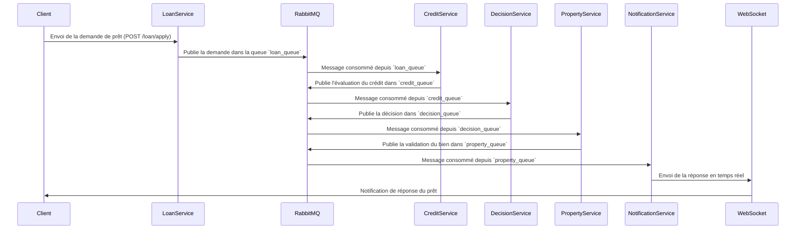

# 📚 Gestion Automatisée des Prêts - README

## ✨ **Description du Projet**
Ce projet est une **application de gestion des demandes de prêt** utilisant une **architecture microservices**. Il permet d'évaluer la solvabilité des demandeurs, de prendre une décision sur l'octroi d'un prêt et d'informer le client en temps réel via **WebSocket**.

### 💡 **Technologies Utilisées**
- **FastAPI** : API RESTful pour gérer les requêtes utilisateurs.
- **RabbitMQ** : Message broker permettant la communication entre services.
- **Celery** : Exécution de tâches asynchrones et gestion des files d'attente.
- **Docker & Docker-Compose** : Conteneurisation des services.
- **Redis** : Backend de stockage pour Celery.
- **Flower** : Interface de monitoring pour Celery.

---

## 🌐 **Architecture du Projet**

### 🎨 **Diagramme de l'Architecture**


## 🔧 **Services et Fonctionnalités**

### Loan Service

#### 📌 Rôle :
Ce service est responsable de la réception des demandes de prêt et de leur envoi à la file d'attente `loan_queue` via RabbitMQ.

#### 🛠️ Critères & Algorithme :
- Vérifie que tous les champs nécessaires sont fournis.
- Extrait les informations pertinentes et les publie dans `loan_queue`.

#### 📥 Entrée (Input) :
```json
{
  "client_id": 456,
  "nom": "Alice Martin",
  "age": 35,
  "revenu_annuel": 75000,
  "credits_en_cours": 2000,
  "situation_professionnelle": "CDI",
  "apport": 60000,
  "valeur_bien": 250000,
  "montant_demande": 100000,
  "duree": 14
}
```

#### 📤 Sortie (vers `loan_queue`) :
```json
{
  "client_id": 456,
  "revenu_annuel": 75000,
  "credits_en_cours": 2000,
  "montant_demande": 100000
}
```

---

### Credit Service

#### 📌 Rôle :
Ce service consomme les messages de `loan_queue`, effectue l'évaluation de la solvabilité du client et envoie les résultats vers `credit_queue`.

#### 🛠️ Critères & Algorithme :
1. **Calcul du taux d’endettement** :
   ```python
   taux_endettement = (credits_en_cours + montant_demande) / revenu_annuel * 100
   ```
2. **Attribution du score de crédit** :
   - Si `taux_endettement < 30%` → Score `>= 700` ✅ (Faible risque)
   - Si `30% ≤ taux_endettement < 40%` → Score `500 - 700` ⚠️ (Risque moyen)
   - Si `taux_endettement ≥ 40%` → Score `< 500` ❌ (Haut risque)

#### 📤 Sortie (vers `credit_queue`) :
```json
{
  "client_id": 456,
  "credit_score": 720,
  "taux_endettement": 25.52
}
```

---

### Decision Service

#### 📌 Rôle :
Ce service reçoit les données de `credit_queue`, prend une décision sur l'approbation du prêt et publie les résultats dans `decision_queue`.

#### 🛠️ Critères :
- **Si `credit_score >= 650`** → Prêt **APPROUVÉ** ✅
- **Si `credit_score < 650`** → Prêt **REJETÉ** ❌

#### 📤 Sortie (vers `decision_queue`) :
```json
{
  "client_id": 456,
  "status": "APPROUVÉ"
}
```

---

### Property Service

#### 📌 Rôle :
Ce service vérifie que la valeur du bien couvre suffisamment le montant demandé. Il consomme les messages de `decision_queue` et envoie les résultats à `property_queue`.

#### 🛠️ Critères :
- Si **valeur_bien ≥ 1.2 * montant_demande** → Statut `VALIDÉ`
- Sinon → Statut `REFUSÉ`

#### 📤 Sortie (vers `property_queue`) :
```json
{
  "client_id": 456,
  "valeur_bien": 250000,
  "montant_demande": 100000,
  "status": "VALIDÉ"
}
```

---

### Notification Service

#### 📌 Rôle :
Ce service consomme les messages de `property_queue` et envoie des notifications en **temps réel** via WebSocket aux utilisateurs.

#### 🛠️ Fonctionnement :
- Se connecte à la WebSocket du client (`ws://localhost:8005/ws/{client_id}`).
- Transmet le statut de la demande de prêt (APPROUVÉ ou REJETÉ).

#### 📤 Sortie (WebSocket) :
```json
{
  "status": "APPROUVÉ",
  "message": "Votre prêt a été accepté !"
}

```

## 🔄 **Installation et Déploiement**

### 1️⃣ **Cloner le projet**
```sh
git clone https://github.com/votre-repo/bpm-loan-system.git
cd bpm-loan-system
```

### 2️⃣ **Lancer l'application avec Docker**
```sh
docker-compose up --build -d
```

### 3️⃣ **Tester l'API**
```sh
curl -X POST "http://localhost:8001/loan/apply/" -H "Content-Type: application/json" -d '{"client_id":456,"nom":"Alice Martin","age":35,"revenu_annuel":75000,"credits_en_cours":2000,"situation_professionnelle":"CDI","apport":60000,"valeur_bien":250000,"montant_demande":100000,"duree":14}'
```

### 4️⃣ **Accéder à l'interface Web**
- **Monitoring Celery** (Flower) : [http://localhost:5555](http://localhost:5555)
- **Notifications WebSocket** : [http://localhost:8005/static/index.html](http://localhost:8005/static/index.html)

---

## 💻 **Monitoring & Debugging**

### 🔎 **Suivre les logs des services**
```sh
docker-compose logs -f loan_service
docker-compose logs -f celery_worker_credit
docker-compose logs -f notification_service
```

### 🔄 **Redémarrer un service en cas d'erreur**
```sh
docker-compose restart notification_service celery_worker_credit
```

### 📊 **Consulter les tâches Celery avec Flower**
```sh
docker-compose up flower
```

---

## 📅 **Exemples de Résultats**
### 💎 **Prêt Approuvé**
```json
{
  "status": "APPROUVÉ",
  "message": "Votre prêt a été accepté !"
}
```

### 📉 **Prêt Rejeté**
```json
{
  "status": "REJETÉ",
  "message": "Taux d'endettement trop élevé."
}
```

---

## **Conclusion**
Ce projet permet :
- **📊 Analyse automatisée** des demandes de prêt.
- **🔄 Communication entre microservices** via RabbitMQ.
- **📞 Notifications WebSocket** en temps réel.
- **🌐 Interface de monitoring** avec Flower.

🚀 **L'application est prête à être testée et déployée !**

